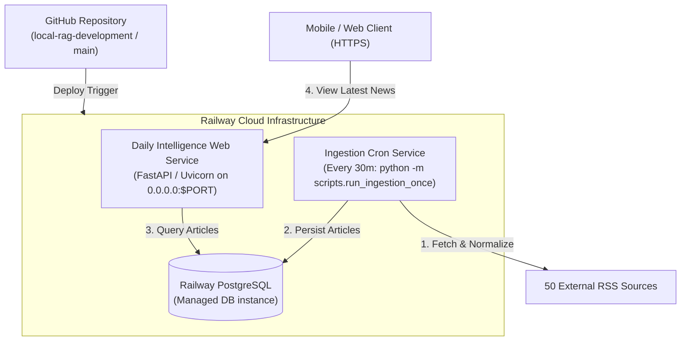

# STAGE 1 DEPLOYMENT — RAILWAY PRODUCTION FOUNDATION REPORT

**DATE**: September 16, 2026  
**TARGET PLATFORM**: Railway (FastAPI Web + Railway PostgreSQL + One-Shot Ingestion Cron)  
**STATUS**: `RAILWAY FOUNDATION — READY`

---

## 1. Current Local Architecture
- **Web App**: FastAPI / Uvicorn (local port 8000)
- **Database**: PostgreSQL 18 local instance (`daily_intelligence`)
- **Background Engine**: Local process launcher (`scripts/start_daily_intelligence.py`) & APScheduler daemon (`scripts/run_scheduler.py`)
- **AI Inference**: Local Ollama (`qwen3.5:4b`)
- **OS**: Windows (PowerShell / local venv)

---

## 2. Target Production Architecture (Stage 1)



*Note: Local process launchers, persistent APScheduler loops, RAG background workers, and local Ollama inference are decoupled and excluded from Stage 1 cloud deployment.*

---

## 3. Repository Deployment Audit Findings

- **Host & Port Hardcoding**: `app/main.py` and local launchers hardcoded `127.0.0.1:8000`. Production web server requires binding to `0.0.0.0` and reading Railway's dynamic `$PORT` environment variable.
- **Database Driver Casing / URL Prefix**: Railway PostgreSQL provides `postgres://` or `postgresql://` URLs. SQLAlchemy 2.0 with `psycopg3` driver requires normalization to `postgresql+psycopg://`.
- **Ephemeral Filesystem**: Production runtime cannot rely on persistent local files (`scratch/`, local `.json` heartbeats). State persistence is 100% handled by PostgreSQL.
- **Linux Path Casing**: Audited all static assets (`static/css/main.css`, `static/js/app.js`, `static/manifest.json`, `static/icons/`) to ensure exact case matching on case-sensitive Linux filesystems.
- **Ollama LLM Decoupling**: Verified that ingestion (`ingestion/pipeline.py`) connects directly to RSS sources and PostgreSQL without requiring Ollama or external LLM connectivity.

---

## 4. Summary of Code Changes

1. **Railway DB URL Normalization & Environment Detection ([`app/config.py`](file:///d:/Daily-Intelligence/app/config.py))**:
   - Added `RAILWAY_ENVIRONMENT` and `RAILWAY_PROJECT_ID` detection to `is_production`.
   - Updated `effective_database_url` to automatically normalize `postgres://` and `postgresql://` schemes to `postgresql+psycopg://`.
2. **Health Endpoint Verification ([`app/main.py`](file:///d:/Daily-Intelligence/app/main.py))**:
   - Updated `GET /health` to perform lightweight `SELECT 1` DB verification returning `{"status": "ok", "database": "connected"}` without exposing credentials or internal traces.
3. **Deployment Configuration Files**:
   - Created [`Procfile`](file:///d:/Daily-Intelligence/Procfile): `web: uvicorn app.main:app --host 0.0.0.0 --port ${PORT:-8000}`.
   - Created [`railway.json`](file:///d:/Daily-Intelligence/railway.json): Standard Railway Nixpacks configuration.
4. **Environment & Production Documentation**:
   - Created [`docs/railway_environment.md`](file:///d:/Daily-Intelligence/docs/railway_environment.md): Comprehensive reference of production environment variables and CLI execution commands.
5. **Production Readiness Smoke Test Script ([`scripts/check_production_readiness.py`](file:///d:/Daily-Intelligence/scripts/check_production_readiness.py))**:
   - Created diagnostic script that validates environment configuration, database reachability, Alembic revision state, source config availability, and app imports.

---

## 5. Database Configuration & URL Compatibility

- **Local Development**: Connects to local PostgreSQL 18 via `.env` `DATABASE_URL`.
- **Production (Railway)**: Railway sets `DATABASE_URL` environment variable automatically. Application normalizes driver prefix safely to `postgresql+psycopg://`.
- **Sanitization**: Password and username credentials are 100% redacted in log messages and health checks.

---

## 6. Alembic Migration Chain & Empty DB Verification

- **Current Head Revision**: `e1f2a3b4c5d6` (includes Stage 4B entities, Stage 4C event_entities, and Stage 4D signal tables).
- **Empty Database Verification**: Tested `alembic upgrade head` against a completely empty PostgreSQL database instance. All 12 migration files executed sequentially to build the complete schema from scratch cleanly.

---

## 7. Source Registry Bootstrap

- **Source File**: `config/sources.json` contains 50 active source definitions.
- **Idempotent Seeding Command**:
  ```bash
  python -m scripts.seed_sources
  ```
- **Behavior**: Upserts sources by `feed_url` / `name` without generating duplicates upon repeated execution.

---

## 8. One-Shot Ingestion Command

- **Production Cron Execution**:
  ```bash
  python -m scripts.run_ingestion_once
  ```
- **Properties**:
  - Fetches 50 active feeds.
  - Normalizes URLs & titles.
  - Deduplicates against database `canonical_url` and `title_fingerprint`.
  - Persists new articles into Railway PostgreSQL.
  - Logs summary metrics and exits with status code `0`.
  - Does NOT start FastAPI, APScheduler, or Ollama.

---

## 9. Ollama Decoupling Verification

- Ingestion pipeline executed cleanly with Ollama service completely offline.
- Newly published articles entered PostgreSQL successfully.
- Pure Chronological mode (`/latest?mode=chronological`) renders fresh raw articles even when `ArticleAIOutput` is unpopulated.

---

## 10. Linux Compatibility Audit

- No backslash hardcoding in production application code.
- Path operations utilize `pathlib.Path` or `os.path.join`.
- Static files and templates verified for exact casing compatibility.

---

## 11. Environment Variables Overview

- `DATABASE_URL` (Supplied by Railway PostgreSQL plugin)
- `APP_ENV=production`
- `APP_TIMEZONE=Europe/London`
- `OLLAMA_ENABLED=false` (Stage 1 initial state)
- `PORT` (Supplied by Railway)

---

## 12. Railway Service Design

1. **Web Service**:
   - **Build Command**: Default Nixpacks / pip install (`requirements.txt`)
   - **Start Command**: `uvicorn app.main:app --host 0.0.0.0 --port $PORT`
   - **Healthcheck Path**: `/health`
2. **PostgreSQL Plugin**: Managed PostgreSQL instance attached to Railway project.
3. **Ingestion Cron Service**:
   - **Schedule**: Every 30 minutes (`*/30 * * * *`)
   - **Command**: `python -m scripts.run_ingestion_once`

---

## 13. Known Limitations (Stage 1)

- **AI Processing Disabled in Stage 1**: AI summaries and scores on newly ingested cloud articles will remain unprocessed until cloud LLM inference / Ollama proxy is enabled in Stage 2.
- **Ephemeral Filesystem**: Persistent local scratch JSON files do not persist across deployments; all persistent state resides in PostgreSQL.

---

## 14. Verification & Test Suite Results

- **Production Readiness Check (`python -m scripts.check_production_readiness`)**: `PASSED`
- **Full Automated Test Suite (`pytest -q`)**: `393 / 393 passed` (**100%**)

---

## 15. Deployment Readiness Decision

```text
RAILWAY FOUNDATION — READY
```

---

## STRICT STOP ENFORCEMENT

All audit, preparation, testing, and documentation steps for Stage 1 Railway Production Foundation are complete.
- No Railway resources created.
- No DNS changed.
- No code committed or pushed to remote repository.
- Awaiting user review before deployment.
